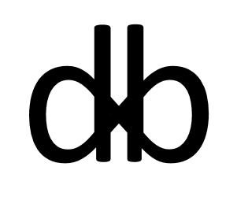

# DB

dxb symbol:  

Contents:

* [Meaning of the meaning](#meaning-of-the-meaning)
* [Science-compatible Cosmogonic myth](#science-compatible-cosmogonic-myth)
  * [Open-ended natural selection of interacting code-data-dual algorithms as a property analogous to Turing completeness](#open-ended-natural-selection-of-interacting-code-data-dual-algorithms-as-a-property-analogous-to-turing-completeness)
  * [Epistemological point of view on the Cosmogonic myth](#epistemological-point-of-view-on-the-cosmogonic-myth)
  * [My contribution to the Open ended evolution research program](#my-contribution-to-the-open-ended-evolution-research-program)

# Meaning of the meaning

Looking ahead, I will say that this article will define objective part of the meaning of life that is universal for every sentient agent and subjective part of the meaning of life that varies from agent to agent. Together they form total meaning of life of the agent.

But first, let's start from afar. In the common sense way there are two notions of the word "meaning". First meaning of the object/subject (x-bject) comes from their place in the grander system - which role-function they perform in it. Like the meaning of an individual animal is that it's surviving and reproducing in the population which leads to similar animals doing the same in the future - that is the self-replicating process in time. The second possible meaning of the x-bjects is given to them by some sentient agent that has goals. The way x-bjects help achieve agent's goals is their meaning. Like the meaning of a hammer is to hammer in nails. The second kind of meaning is also the first kind if we specify the sentient agent with goals.

# Science-compatible Cosmogonic myth

Remembering two mentioned notions of "meaning" let's put them in the perspective of the cosmogonic myth that is compatible with modern science.

## Open-ended natural selection of interacting code-data-dual algorithms as a property analogous to Turing completeness

*This section contains the core hypothesis of the Cosmogonic myth.*

In mathematics there is a notion of [Turing Completeness](https://en.wikipedia.org/wiki/Turing_completeness) (TC) that is a property of languages that describe algorithms. Simply put TC means that all fully understood data-manipulation algorithms and formal actions can be expressed via TC language. There can be many such languages, but for all of them mathematicians prove equivalence in the ability to execute the same algorithms.

Evolution and [natural selection](https://en.wikipedia.org/wiki/Natural_selection) (NS) are, albeit incomplete, but models for the generation, accumulation and preserving of innovations and the complication of the structure of agents (called individuals) in competition. This all is happens with access to energy batteries. NS explains the entire path traversed by the life from the first unicellular organisms to Homo sapiens. And they differ much in complexity accumulated novelty.

By analogy with Turing complete languages for describing algorithms, it can be assumed that it is possible to build dynamic models in which natural selection takes place. And more, let's assume that it's possible to build models in which natural selection does not stop at some fixed level of complexity of individuals, but leads to their further complication and, after an enormous simulation time, leads to the emergence of intelligent agents. Such models are called [Open ended evolution](https://www.reddit.com/r/oee/) (OEE) models. Presumably they are also [Autoconstructive](https://en.wikipedia.org/wiki/Autoconstructive_evolution).

After any OEE model would be built we can do the same as we did with Turing completeness (TC) and prove equivalence of other OEE models to the first one. One can even optimistically expect the identification of a class of models whose dynamics of events probabilities can be reduced to each other. Hence we would extract invariant events dynamics. It can even be expected that individuals in the OEE models would be able to perform TC algorithms in the infinite time limit.

If we remember that OEE models, if discovered, would be models of the novelty emergence then it would be natural to believe-assume that the entire universe itself is also described by this invariant OEE dynamics that can be called the simplest OEE model. An endless process of survival and accumulation of novelty. This view is consistent with Lee Smolin's [Cosmological natural selection](https://en.wikipedia.org/wiki/Cosmological_natural_selection).

Now let's talk about properties of OEE model applied to the entire universe. As it's a model of novelty emergence and accumulation then we can safely expect that at the basic level it contains only what is necessary. And everything else, for example, the topology of space and a decent part of the known laws of physics appeared as a result of natural selection.

Hence, it's a relatively simple model that generates complex structures. This assumption may even facilitate the discovery of the first OEE model (or may not). But I digress. Within the framework of the cosmogonic myth, we will simply believe that the universe is described by such simplest OEE model.

Let's note what properties of the OEE model can be confidently assumed. Obviously it obeys the postulates of the natural selection: individuals and (are?) environment (aka ontology), reproduction (aka doubling), heredity, variation (aka random), selection (aka death). In more details:

* Population of individuals and (are?) the environment. The individuals themselves are part of the environment for other individuals.
* Reproduction: each individual has a potential to reproduce itself. At least it has a potential to double the number of approximate copies of itself.
* Heredity: properties of the individuals are inherited in reproduction.
* Variation: when the individual reproduces itself, the reproduction does not occur precisely but with changes that are partly random/spontaneous (under a given set of postulates).
* Natural selection: the individuals that are more adapted to the environment survive more often.

As noted by Karl Popper the theory of evolution is a theory of **gradual changes** that does not permit spontaneous appearance of monsters such as [Boltzmann brain](https://en.wikipedia.org/wiki/Boltzmann_brain).

Finally, I would like to point out that it can be helpful to think of the simplest OEE model on the base level as interacting [code-data-dual algorithms](https://en.wikipedia.org/wiki/Code_as_data). This is in line with [Autoconstructive evolution](https://en.wikipedia.org/wiki/Autoconstructive_evolution).

## Epistemological point of view on the Cosmogonic myth

*This section contains some philosophy heavy commentary to the core hypothesis of the Cosmogonic myth. Can be skipped.*

But what justification can the aforementioned Cosmogonic myth have? Let's start from [Pragmatic maxim](https://en.wikipedia.org/wiki/Pragmatic_maxim) by Charles Sanders Peirce that is a good starting point to defining how our understanding of the universe works:

> To ascertain the meaning of an intellectual conception one should consider what practical consequences might result from the truth of that conception — and the sum of these consequences constitute the entire meaning of the conception.
> 
> Consider what effects, that might conceivably have practical bearings, we conceive the object of our conception to have. Then, our conception of these effects is the whole of our conception of the object.

([Charles Sanders Peirce, 1902-1905](https://en.wikipedia.org/wiki/Pragmatic_maxim))

It states that our understanding of anything is limited to expected experimental results of actions (“practical consequences”). But certainly we can do better and also obtain understanding about the past events or “virtual” events that precede results of actions-experiments. Good way for this is to extend pragmatic maxim with [Falsifiability](https://en.wikipedia.org/wiki/Falsifiability). It states that all useful theories should have precise predictions about experimental results of actions. And such predictions should be possible to refute in the experiment. A useful theory would "survive" all such attempts to refute it. A useless theory won't provide experiments to refute it. 

I'm sure that past events and “virtual” events that are described by the theory also form our understanding of the universe. We should not deny them realism. The problem is that we are not completly sure that the theory really describes events of the past. There can be many different theories that make the same predictions of the experimental results but differ in descriptions of the past and "virtual" events. One or them is the real one that corresponds to the history of the universe.

[Occam's razor](https://en.wikipedia.org/wiki/Occam%27s_razor) is good enough arbiter: “*when presented with competing hypotheses about the same prediction, one should select the solution with the fewest assumptions*”. But we are still not sure about it completely. In local theories, it would be nice to have the probability distributions of hypotheses (which require the assumption of more or less probable events). But for the choice of theories of evolution of the entire universe, this will not be available. So all that remains is to use Occam's Razor.

Now that we have some context on how to define understanding let's return to the Cosmogonic myth that answers ancient philosophical questions.

Ancient metaphysical question **“[Why is there something rather than nothing?](https://en.wikipedia.org/wiki/Why_is_there_something_rather_than_nothing%3F)”** is obviously answered **“It just is”** and obviously is reformulated into **“Why these structures exist instead of other structures?”**. The second question should be delegated to Science that should create a mathematical model of the Universe that is capable of answering all such questions. Our Universe should be **possible** in that model and existence of sentient life should be **probable** in such model. The model should be capable of giving predictions of the future (and it should be the very same model that gave explanations - not some ad hock addition). Let's call such a theory The Ultimate Theory (TUT) (like Douglas Adams's “[The Ultimate Question of Life, the Universe, and Everything](https://en.wikipedia.org/wiki/Phrases_from_The_Hitchhiker%27s_Guide_to_the_Galaxy#The_Answer_to_the_Ultimate_Question_of_Life,_the_Universe,_and_Everything_is_42)”).

But what is the philosophical justification for The Ultimate Theory? How can it even claim to answer all **“Why these structures exist instead of other structures?”** questions? Let's assume that we have a theory that can answer all questions about reality. Such answers would either be postulates of the model or conclusions from the postulates. Conclusions part is obvious - that's exactly the meaning of "answering". But what about postulates? Why are they the way they are? And the obvious answer is **“They just are”** - we should start from something after all. If the theory is capable of answering all those questions then it's enough. That's our best idea about TUT. What if there would be another TUT? The one in which our Universe is more probable is better (assuming that they are equal in other aforementioned regards). If we would have several theories with equal probability of our Universe then the one with fewer assumptions is better. And if there are several simplest models we can only hope that they would constitute an equivalence class with isomorphic events probabilities (if events probs. are not isomorphic then this line of thought should be revised). And the objective part is abstracted this way. Like the notion of computability is abstracted in Turing completeness property or [Gauge invariance](https://physics.stackexchange.com/questions/266992/what-in-simplest-terms-is-gauge-invariance/267044#267044) to some constant (“Gauging away” as Lee Smolin called it).

So the key ideas are:

* “They just are”,
* The one where our Universe is more probable is better,
* The one with fewer assumptions is better,
* Abstracting into single equivalence class (“Gauging away”) all differences that are left (exсept for “real” events probabilities).
* Hoping that there are no “real” events probabilities differnces after “Gauging away”.

## My contribution to the Open ended evolution research program

*This section reiterates and emphasizes my idea on how to search for OEE model. Can be skipped.*

My contribution to Open ended evolution (OEE) research program comes from philosophy direction. The minimal model with *Open-ended natural selection of interacting code-data-dual algorithms* (or an equivalence class of minimal models) is a quite good canditate for a model of the Universe on the deepest level - as models with OEE are models of novelty emegrence. If so then we can investigate very simple models for being suitable to contain OEE - as it's philosophically intuitive for a deepest level of the Universe to be relatively simple with even space and most of the laws of nature being emergent (formed as a result of [natural selection for a very long time](https://en.wikipedia.org/wiki/Cosmological_natural_selection)). We can even assume beginning of the Universe from a very simple (may be even singular) state that with time became more complex via dynamic with Natural Selection postulates. Novelty and complication of structure comes from random-variation influensing heredity laws (code-data-dual algorithms reproducing and partially randomly modifying each other). Hence simple and ontologically basic models seem to be promising investigation direction for OEE research program (and may make it easier to solve).

# Section X

> “All right,” said Ford, “forget that. I mean… I mean, look, do you know—do you know how the Universe actually began for a kick off?”
> 
> “Probably not,” said Arthur, who wished he’d never embarked on any of this.
> 
> “All right,” said Ford, “imagine this. Right. You get this bath. Right. A large round bath. And it’s made of ebony.”
> 
> “Where from?” said Arthur. “Harrods was destroyed by the Vogons.”
> 
> “Doesn’t matter.”
> 
> “So you keep saying.”
> 
> “Listen.”
> 
> “All right.”
> 
> “You get this bath, see? Imagine you’ve got this bath. And it’s ebony. And it’s conical.”
> 
> “Conical?” said Arthur. “What sort of…”
> 
> “Shhh!” said Ford. “It’s conical. So what you do is, you see, you fill it with fine white sand, all right? Or sugar. Fine white sand, and/or sugar. Anything. Doesn’t matter. Sugar’s fine. And when it’s full, you pull the plug out… are you listening?”
> 
> “I’m listening.”
> 
> “You pull the plug out, and it all just twirls away, twirls away you see, out of the plughole.”
> 
> “I see.”
> 
> “You don’t see. You don’t see at all. I haven’t got to the clever bit yet. You want to hear the clever bit?”
> 
> “Tell me the clever bit.”
> 
> “I’ll tell you the clever bit.” Ford thought for a moment, trying to remember what the clever bit was.”
> 
> “The clever bit,” he said, “is this. You film it happening.”
> 
> “Clever,” agreed Arthur.
> 
> “You get a movie camera, and you film it happening.”
> 
> “Clever.”
> 
> “That’s not the clever bit. This is the clever bit, I remember now that this is the clever bit. The clever bit is that you then thread the film in the projector… backward!”
> 
> “Backward?”
> 
> “Yes. Threading it backward is definitely the clever bit. So then, you just sit and watch it, and everything just appears to spiral upward out of the plughole and fill the bath. See?”
> 
> “And that’s how the Universe began, is it?” said Arthur.
> 
> “No,” said Ford, “but it’s a marvelous way to relax.”

Douglas Adams. The Restaurant at the End of the Universe (The Hitch Hiker's Guide to the Galaxy #2)
