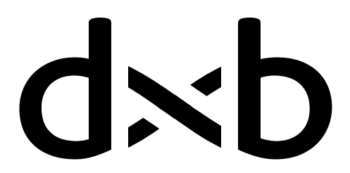

Origin: Darwin-Buddhism on objective meaning of life separated from subjective meaning of life (dxb: Cosmogonic myth of Darwinian natural selection, Quasi-immortality, Free will, Buddhism-like illusion of Self)
=======================================================

Contents:

* [Introduction to Darwin-Buddhism](#introduction-to-darwin-buddhism)
* [Cosmogonic myth of Darwinian natural selection (relevant for dxb)](#cosmogonic-myth-of-darwinian-natural-selection-relevant-for-dxb) 
* [Quasi-immortality as a meaning of life](#quasi-immortality-as-a-meaning-of-life)
* [Free will as a necessity to maximize survival probability](#free-will-as-a-necessity-to-maximize-survival-probability)
* [Darwinian interpretation of the Buddhist illusion of Self. Death is bad but the death of what?](#darwinian-interpretation-of-the-buddhist-illusion-of-self-death-is-bad-but-the-death-of-what)
* [Objective meaning of life separated from subjective meaning of life](#objective-meaning-of-life-separated-from-subjective-meaning-of-life)
* [Cosmogonic myth of Darwinian natural selection in depth](#cosmogonic-myth-of-darwinian-natural-selection-in-depth)
  * [Open-ended natural selection of interacting code-data-dual algorithms as a property analogous to Turing completeness](#open-ended-natural-selection-of-interacting-code-data-dual-algorithms-as-a-property-analogous-to-turing-completeness)
  * [Epistemological point of view on the Cosmogonic myth](#epistemological-point-of-view-on-the-cosmogonic-myth)
  * [My contribution to the Open ended evolution research program](#my-contribution-to-the-open-ended-evolution-research-program)
  * [Possible OEE research directions: Self-reference, quantum computers, discrete ontology might not be enough](#possible-oee-research-directions-self-reference-quantum-computers-discrete-ontology-might-not-be-enough)
  * [Primordial chaos of Tamed Lovecraftian horror as a Source of infinite energy (aka Free lunch that might eat you)](#primordial-chaos-of-tamed-lovecraftian-horror-as-a-source-of-infinite-energy-aka-free-lunch-that-might-eat-you)

Introduction to Darwin-Buddhism
=====================================================

Meaning of the Darwin-Buddhism “dxb” symbol that encodes key ideas of the Darwin-Buddhism:

* (**d**) Cosmogonic myth of Darwinian natural selection is at Darwin-Buddhism core as a setting where everything takes place. The whole universe is a “jungle”, but survives not the strongest but survives the one who survives. And it is often the ones who balanced competition ([Moloch](https://slatestarcodex.com/2014/07/30/meditations-on-moloch/)) and cooperation ([Slack](https://slatestarcodex.com/2020/05/12/studies-on-slack/)) as Scott Alexander called them. Competing for limited resources balanced with cooperating to increase the total amout of resources.
* (**∞** infinity) Quasi-immortality as a meaning of life. Quasi-immortal entities within the framework of natural selection are entities that can potentially exist forever albeit gradually changing. For example individuals with limited lifespan are not quasi-immortal but populations of such individuals are quasi-immortal entities. Religions, ideologies, nations, countries, noble families, corporations can also be such quasi-immortal entities (even populations of clonal digital sentient agents can be quasi-immortal entities). Beware that not all self-sustaining processes are a quasi-immortal entities. Some are suicide spirals whose death can be predicted beforehand. And this is not to mention the cases when the process is disguised or pretends to be something that it is not.
* (**U** openness) Free will as necessity to maximize survival probability. Sentient agents actively optimize their survival probability via actions. But they are ultimately not sure if such actions would really increase their survival as they have 1) probabilistic predictions, 2) limited prediction window. To workaround this limitation they should be able to spontaneously choose truly random locally non-optimal actions that in reality would lead to survival of subpopulation of sentient agents - fallback to blind and planless natural selection (globally optimal actions). Quasi-immortal entities that are quasi-sentient (like corporations) should also uphold free will in order to maximize survival probability. If some entity looses free will and becomes completely dependent on will of other entity then it's survival potential is severely reduced. At least it should have some chance to break free and return to free will state. If there is no chance even then the entity truly became merely a part of the another.
* (**b**) Buddhism-like illusion of Self: Death is bad but the death of what? “Self” is not quasi-immortal hence it's preservation cannot be the meaning of life. It's not **always** useful to worry about its safety. We should worry about the survival of quasi-immortal entities. Sentient agent's meaning of life is to have a goal to maximize survival of some quasi-immortal entity. And we are actually free to choose one or several of many to be our meaning of life. But in most cases we inherit these meanings (note that if an act of such choosing is conscious then it can be viewed as a demiurge-like act of creation). Preserving Self helps to achieve this goal in most cases. But there are notable and important cases when preserving Self impedes to achieve this goal. Heroic self-sacrifice began to be glorified for a reason.

*From all Buddhism only the illusion of Self is used in Darwin-Buddhism. So Buddhist-Darwinism would be a more correct term - but that sounds worse. The name Darwin-Buddhism can also be justified because the part about illusion of Self is the most difficult to accept.*

Cosmogonic myth of Darwinian natural selection (relevant for dxb)
=================================================================

**(d)**

The [Cosmogonic myth of Darwinian natural selection **in depth**](#cosmogonic-myth-of-darwinian-natural-selection-in-depth) section at the end of the article will create an atmosphere and tries to pave an intuition to create a mathematical model of this cosmogony. But for this and few following sections, it's enough to imagine that the entire universe obeys the rules of natural selection (NS), and there are no other more fundamental rules to be followed. That is, not evolution and NS arose from the known laws of physics, but the laws of physics arose as a result of NS.

Before natural selection was discovered it was natural to believe-assume that the entire universe was created by primordial general intelligence (aka God) as intelligence was the only known thing capable of explaining novelty emergence. Evolution and natural selection is the best explanation for novelty emergence that we have at the moment: an endless process of survival and accumulation of novelty. 

Cosmogonic myth of Darwinian natural selection is at Darwin-Buddhism core as a setting where everything takes place. The whole universe is a “jungle”, but survives not the strongest but survives the one who survives. And it is often the ones who balanced [Moloch](https://slatestarcodex.com/2014/07/30/meditations-on-moloch/)-competition and [Slack](https://slatestarcodex.com/2020/05/12/studies-on-slack/)-cooperation as Scott Alexander called them. Competing for limited resources balanced with cooperating to increase the total amount of resources.

Quasi-immortality as a meaning of life
======================================

**(∞)**

Quasi-immortality as a meaning of life. Quasi-immortal entities within the framework of natural selection are entities that can potentially exist forever albeit gradually changing. For example individuals with limited lifespan are not quasi-immortal but populations of such individuals are quasi-immortal entities. Religions, ideologies, nations, countries, noble families, corporations can also be such quasi-immortal entities (even populations of clonal digital sentient agents can be quasi-immortal entities). Beware that not any self-sustaining process is a quasi-immortal entity. Some are suicide spirals whose death can be predicted beforehand. And this is not to mention the cases when the process is disguised or pretends to be something that it is not.

*First I encountered notion of “potentially immortal populations” in the [article by Dmitry Shabanov](https://old.computerra.ru/own/shabanov/612801/) ([autotranslated](https://translate.google.com/translate?sl=ru&tl=en&u=https://old.computerra.ru/own/shabanov/612801/)):*

> **Dmitry Shabanov: On the immortality of populations**  
> *See the history of life on earth as a branching tree of potentially immortal populations. It is they, the populations, that inhabit the Earth, and not we, the organisms!*

Free will as a necessity to maximize survival probability
=========================================================

**(U)**

Free will as necessity to maximize survival probability. Sentient agents actively optimize their survival probability via actions. But they are ultimately not sure if such actions would really increase their survival as they have 1) probabilistic predictions, 2) limited prediction window. To workaround this limitation they should be able to spontaneously choose truly random locally non-optimal actions that in reality would lead to survival of subpopulation of sentient agents - fallback to blind and planless natural selection (globally optimal actions). Quasi-immortal entities that are quasi-sentient (like corporations) should also uphold free will in order to maximize survival probability. If some entity looses free will and becomes completely dependent on will of other entity then it's survival potential is severely reduced. At least it should have some chance to break free and return to free will state. If there is no chance even then the entity truly became merely a part of the another.

Some might think that if an agent uses some external random generator for it's free will then the agent is not truly free. Surely it would be more convenient to have a random generator inside the agent but if the perfectly deterministic agent obtains external truly random generator then he together with this generator would form a system that has free will. The issue merely about where we mark borders of an agent (of Self in case of humans). And this external random generator should be really random - not working in favor of some other hidden agent.

If we are to examine quasi-immortal entities like collectives of people then the question of preserving the free will of the collective as a whole is important. If we imagine a collective where each individual is not free except the “God-Emperor” at the top then how does this collective is resilent to attempts to enslave it via hacking this “God-Emperor”. It depends. But I bet it's not optimally resilent. Hence I assume that some subparts of this collective should have partial freedom. Though how this can be organized in practice is not clear. “Roman Republic” comes to mind but I guess that's not the only way to add control feedback loop from subsystems to the executive core of the collective.

We can also note that “God-Emperor”-like collectives can be more effective and competitive against “Roman Republic”-like collectives in direct confrontation-competition. Hence there is an optimization task to balance effectiveness and stability of the collectives.

Darwinian interpretation of the Buddhist illusion of Self. Death is bad but the death of what?
==============================================================================================

**(b)**

Buddhism-like illusion of Self: Death is bad but the death of what? “Self” is not quasi-immortal hence it's preservation cannot be the meaning of life. It's not **always** useful to worry about its safety. We should worry about the survival of quasi-immortal entities. Sentient agent's meaning of life is to have a goal to maximize survival of some quasi-immortal entity. And we are actually free to choose one or several of many to be our meaning of life. But in most cases we inherit these meanings (note that if an act of such choosing is conscious then it can be viewed as a demiurge-like act of creation). Preserving Self helps to achieve this goal in most cases. But there are notable and important cases when preserving Self impedes to achieve this goal. Heroic self-sacrifice began to be glorified for a reason.

Lots of religions promise an afterlife which reduces fear of the death of Self and makes it easier to achieve goals that go beyond one human life. And linear time in Christianity (versus the cyclical time of previous beliefs) makes this even easier. That's a useful “hack” in my opinion.

Now let's imagine the survival of which quasi-immortal entities can be the meaning of life. Let's put them on a simplified 1D-map.

* dxb=0 — the survival of as accurate copies of an intelligent agent as possible is the goal. So, if the almighty Genie comes to the Darwin-Buddhist-dxb=0 and offers to make two exact copies of him in exchange for destroying the original, then the Darwin-Buddhist agrees with joy and fear — for it is profitable exchange, whatever one may say. Any other Darwin-Buddhist-dxb>0 will also agree (except for the obvious exceptions like “God-Emperor” who will have a power crisis from this).

* dxb=0.5 — the survival of the human population as a whole is the goal. Including surviving the transformation of the Sun into a red giant and the possible death of the universe. Over time, human cyborgization and augmentation using AI will leave less and less human in people. In the future limit if the goal is to keep humanity in its current form, the super AI will maintain the existence of humanity as merely a ritual integrated into its goals. Just like a super AI which sole purpose is to make paper clips. In order to prevent such a dull ending in the framework of dxb=0.5, it is necessary that super AI come directly from digitized people (with all their values), augmented by AI. But maybe I'm overly pessimistic, and a combination of super AI with genetically modified people who are in charge and make decisions will also work.

* dxb=1 — the survival of any intelligent life is the goal.

* 0<dxb<0.5 — the goal is the survival of some quasi-immortal entity formed by a group of people, more diverse than the clones of one person, but narrower than all humanity. In the hierarchy of goals of this group, it is possible to lower the probability of humanity survival if it increases the probability of survival of the quasi-immortal entity. Examples of such entities are: religions, ideologies, nations, countries, noble families, corporations.

* dxb<0 — suicidal heresy (not a Darwin-Buddhism way) where all goals lead only to death. In the hierarchy of the agent's goals, one can sacrifice the survival of any quasi-immortal entity for the sake of a non-quasi-immortal one. The unlimited value of the “Self” is a special case of suicidal heresy.

* dxb>1 — heresy of putting not sentient beings before sentient (not a Darwin-Buddhism way). In the hierarchy of the agent's goals, one can sacrifice any intelligent life for the sake of not sentient life. And this sacrifice is made not in order to somehow optimize the success of intelligent life.

It should be noted that competition between dxb<0.5 can be useful for dxb=0.5, because some level of competition is necessary to maintain the humanity as a whole in a healthy state (the same is true for dxb<1 and dxb=1 by the way). From the standpoint of dxb=0.5, it is necessary to determine a set of rules of competition (including economic and military ones), the adherence to which will support the healthy development of mankind as a whole (dxb=0.5). This might help to achieve sustainable development — prevent going down on the disappearing stairway of energy source batteries, as well as make humanity competitive when meeting aliens in the future. And in most cases Darwin-Buddhists-dxb=0.5 will need to take part in this competition. Moreover, they will have to honestly choose a side and be loyal to the interests of the group dxb<0.5.

It is also worth dwelling in more detail on the disappearing stairway of energy source batteries. The technological civilization of the mankind consumes more and more energy, absorbing concentrated energy obtained from a star (peat, coal, oil). But these energy sources are finite. What will happen if in its development civilization “stumbles and falls” to a technological level that requires coal but all coal has already been exhausted? In the worst case it will be stuck at some level of development forever and will never be able to reach the level of using the energy of the stars directly (like [Dyson sphere](https://en.wikipedia.org/wiki/Dyson_sphere)). This is a serious existential risk that should be considered.

Objective meaning of life separated from subjective meaning of life
===================================================================

Let's define objective part of the meaning of life that is universal for every sentient agent and subjective part of the meaning of life that varies from agent to agent. Together they form total meaning of life of the agent.

In the common sense way there are two notions of the word “meaning”. First meaning of the object/subject (x-bject) comes from their place in the grander system — which role-function they perform in it. Like the meaning of an individual animal is that it's surviving and reproducing in the population which leads to similar animals doing the same in the future — that is the self-replicating process in time. The second possible meaning of the x-bjects is given to them by some sentient agent that has goals. The way x-bjects help achieve agent's goals is their meaning. Like the meaning of a hammer is to hammer in nails. The second kind of meaning is also the first kind if we specify the sentient agent with goals.

* Evolution and natural selection as a backgroud for “everything”. Quasi-immortal entities survival as objective meaning of any life.
* Choosing particular quasi-immortal entities survival as a subjective meaning of life. It can be several of an infinite number of entities. Some entities are more fit to survive than others. But in most cases we inherit these meanings instead of choosing them (note that if an act of such choosing is conscious then it can be viewed as a demiurge-like act of creation).
* Goals and values that cannot be reformulated as survival of some quasi-immortal entities are meaningless and would be eliminated via natural selection with time.

Cosmogonic myth of Darwinian natural selection in depth
=======================================================

Cosmogonic myth of Darwinian natural selection is at Darwin-Buddhism core as a setting where everything takes place. The whole universe is a “jungle”, but survives not the strongest but survives the one who survives.

Open-ended natural selection of interacting code-data-dual algorithms as a property analogous to Turing completeness
--------------------------------------------------------------------------------------------------------------------

*This section contains the core hypothesis of the Cosmogonic myth.*

In mathematics there is a notion of [Turing Completeness](https://en.wikipedia.org/wiki/Turing_completeness) (TC) that is a property of languages that describe algorithms. Simply put TC means that all fully understood data-manipulation algorithms and formal actions can be expressed via TC language. There can be many such languages, but for all of them mathematicians prove equivalence in the ability to execute the same algorithms. In other words it's a formalization of computability and algorithms that previously were performed by humans and DNA/proteins. There are different formalizations including [Turing machine](https://en.wikipedia.org/wiki/Turing_machine), [μ-recursive functions](https://en.wikipedia.org/wiki/General_recursive_function) and [λ-calculus](https://en.wikipedia.org/wiki/Lambda_calculus).

Evolution and [natural selection](https://en.wikipedia.org/wiki/Natural_selection) (NS) are, albeit incomplete, but models for the generation, accumulation and preserving of innovations and the complication of the structure of agents (called individuals) in competition. This all happens with access to energy batteries. NS explains the entire path traversed by the life from the first unicellular organisms to Homo sapiens. And they differ much in complexity / accumulated novelty.

By analogy with Turing complete languages for describing algorithms, it can be assumed that it is possible to build dynamic models in which natural selection takes place. And more, let's assume that it's possible to build models in which natural selection does not stop at some fixed level of complexity of individuals, but leads to their further complication and, after an enormous simulation time, leads to the emergence of intelligent agents. Such models are [artificial life](https://en.wikipedia.org/wiki/Artificial_life) models and are called [Open ended evolution](https://www.reddit.com/r/oee/) (OEE) models. Presumably they are also [Autoconstructive](https://en.wikipedia.org/wiki/Autoconstructive_evolution). This property can be named **natural selection open-endedness**.

After any OEE model would be built we can do the same as we did with Turing completeness (TC) and prove equivalence of other OEE models to the first one. One can even optimistically expect the identification of a class of models whose dynamics of events probabilities can be reduced to each other. Hence we would extract invariant events dynamics. It can even be expected that individuals in the OEE models would be able to perform TC algorithms in the infinite time limit.

If we remember that OEE models, if discovered, would be models of the novelty emergence then it would be natural to believe-assume that the entire universe itself is also described by this invariant OEE dynamics that can be called the simplest OEE model. An endless process of survival and accumulation of novelty. This view is consistent with Lee Smolin's [Cosmological natural selection](https://en.wikipedia.org/wiki/Cosmological_natural_selection). Note that before natural selection was discovered it was natural to believe-assume that the entire universe was created by primordial general intelligence (aka God) as intelligence was the only known thing capable of explaining novelty emergence.

Now let's talk about properties of OEE model applied to the entire universe. As it's a model of novelty emergence and accumulation then we can safely expect that at the basic level it contains only what is necessary. And everything else, for example, the topology of space and a decent part of the known laws of physics appeared as a result of natural selection.

Hence, it's a relatively simple model that generates complex structures. This assumption may even facilitate the discovery of the first OEE model (or may not). But I digress. Within the framework of the cosmogonic myth, we will simply believe that the universe is described by such simplest OEE model.

Let's note what properties of the OEE model can be confidently assumed. Obviously it obeys the postulates of the natural selection: individuals and environment / individuals are environment (aka ontology), reproduction (aka doubling), heredity, variation (aka random), selection (aka death). In more details:

* Population of individuals and the environment / individuals that are the environment. The individuals themselves are part of the environment for other individuals.
* Reproduction: each individual has a potential to reproduce itself. At least it has a potential to double the number of approximate copies of itself.
* Heredity: properties of the individuals are inherited in reproduction.
* Variation: when the individual reproduces itself, the reproduction does not occur precisely but with changes that are partly random/spontaneous (under a given set of postulates).
* Natural selection: the individuals that are more adapted to the environment survive more often.

Some useful notes:

* As noted by Karl Popper the theory of evolution is a theory of **gradual changes** that does not permit spontaneous appearance of monsters such as [Boltzmann brain](https://en.wikipedia.org/wiki/Boltzmann_brain).
* The [Red Queen hypothesis](https://en.wikipedia.org/wiki/Red_Queen_hypothesis) can be useful to explain why complexity is increasing in Natural selection: “Now, **here**, you see, it takes all the running you can do, to keep in the same place.”,
* Natural selection postulates require “variation” that need random events. If we are to apply Occam's Razor then that random events just are and do not have a cause (the flip of a coin has a reason but whether it's heads or tails doesn't have a reason). Hence OEE models are [indeterministic](https://en.wikipedia.org/wiki/Indeterminism) by construction.
* It can be helpful to think of the simplest OEE model on the base level as interacting [code-data-dual](https://en.wikipedia.org/wiki/Code_as_data) algorithms. This is in line with [Autoconstructive evolution](https://en.wikipedia.org/wiki/Autoconstructive_evolution). Code-data duality is needed for algorithms being able to modify each other or even themselves.
* I guess that open-endedness may incorporate some weaker “future potency” form of Turing completeness (if to assume discrete ontology with finite space and countable-infinite time then algorithms can became arbitrary complex and access infinite memory only in infinity time limit).

Epistemological point of view on the Cosmogonic myth
----------------------------------------------------

*This section contains some philosophy heavy commentary to the core hypothesis of the Cosmogonic myth. Can be skipped.*

But what justification can the aforementioned Cosmogonic myth have? Let's start from [Pragmatic maxim](https://en.wikipedia.org/wiki/Pragmatic_maxim) by Charles Sanders Peirce that is a good starting point to defining how our understanding of the universe works:

> To ascertain the meaning of an intellectual conception one should consider what practical consequences might result from the truth of that conception — and the sum of these consequences constitute the entire meaning of the conception.
> 
> Consider what effects, that might conceivably have practical bearings, we conceive the object of our conception to have. Then, our conception of these effects is the whole of our conception of the object.

([Charles Sanders Peirce, 1902-1905](https://en.wikipedia.org/wiki/Pragmatic_maxim))

It states that our understanding of anything is limited to expected experimental results of actions (“practical consequences”). But certainly we can do better and also obtain understanding about the past events or “virtual” events that precede results of actions-experiments. Good way for this is to extend pragmatic maxim with [Falsifiability](https://en.wikipedia.org/wiki/Falsifiability). It states that all useful theories should have precise predictions about experimental results of actions. And such predictions should be possible to refute in the experiment. A useful theory would “survive” all such attempts to refute it. A useless theory won't provide experiments to refute it. 

I'm sure that past events and “virtual” events that are described by the theory also form our understanding of the universe. We should not deny them realism. The problem is that we are not completly sure that the theory really describes events of the past. There can be many different theories that make the same predictions of the experimental results but differ in descriptions of the past and “virtual” events. One or them is the real one that corresponds to the history of the universe.

First way to judge such theories is to only use stochastic theories that generate evolution events histories. This way we could range them by probability to obtain our universe in one of the histories. The one where our Universe is more probable is better. Or may be it's better to use probability to obtain any sentient life (and evolution chain of events should be more probable than Bolzmann brain appearance). But this still leaves too many free parameters to finetune. For this [Occam's razor](https://en.wikipedia.org/wiki/Occam%27s_razor) is good enough arbiter: “*when presented with competing hypotheses about the same prediction, one should select the solution with the fewest assumptions*”. But even now we are still not sure about it completely. Hence we need a stochastic theory with as minimal number of assumptions-postulates as possible.

Now that we have some context on how to define understanding let's return to the Cosmogonic myth that answers ancient philosophical questions.

Ancient metaphysical question “**[Why is there something rather than nothing?](https://en.wikipedia.org/wiki/Why_is_there_something_rather_than_nothing%3F)**” is obviously answered “**It just is**” and obviously is reformulated into “**Why these structures exist instead of other structures?**”. The second question should be delegated to Science that should create a mathematical model of the Universe that is capable of answering all such questions. Our Universe should be **possible** in that model and existence of sentient life should be **probable** in such model. The model should be capable of giving predictions of the future (and it should be the very same model that gave explanations — not some ad hock addition). Let's call such a theory The Ultimate Theory (TUT) (like Douglas Adams's “[The Ultimate Question of Life, the Universe, and Everything](https://en.wikipedia.org/wiki/Phrases_from_The_Hitchhiker%27s_Guide_to_the_Galaxy#The_Answer_to_the_Ultimate_Question_of_Life,_the_Universe,_and_Everything_is_42)”). Do not mix TUT with [Grand Unified Theories](https://en.wikipedia.org/wiki/Grand_Unified_Theory) and [Theories of everything](https://en.wikipedia.org/wiki/Theory_of_everything).

But what is the philosophical justification for The Ultimate Theory? How can it even claim to answer all “**Why these structures exist instead of other structures?**” questions? Let's assume that we have a theory that can answer all questions about reality. Such answers would either be postulates of the model or conclusions from the postulates. Conclusions part is obvious — that's exactly the meaning of “answering”. But what about postulates? Why are they the way they are? And the obvious answer is “**They just are**” — we should start from something after all. If the theory is capable of answering all those questions then it's enough. That's our best idea about TUT. What if there would be another TUT? The one in which our Universe is more probable is better (assuming that they are equal in other aforementioned regards). If we would have several theories with equal probability of our Universe then the one with fewer assumptions is better. And if there are several simplest models we can only hope that they would constitute an equivalence class with isomorphic events probabilities (if events probs. are not isomorphic then this line of thought should be revised). And the objective part is abstracted this way. Like the notion of computability is abstracted in Turing completeness property or [Gauge invariance](https://physics.stackexchange.com/questions/266992/what-in-simplest-terms-is-gauge-invariance/267044#267044) to some constant (“Gauging away” as Lee Smolin called it).

So the key ideas about theories are:

* The one which “survived” as much experimental attempts to refute it as possible is better,
* The one where our Universe is more probable is better,
* The one with fewer assumptions is better,
* Abstracting into single equivalence class (“Gauging away”) all differences amoung equal models that are left (except for “real” events probabilities),
* Hoping that there are no “real” events probabilities differences after “Gauging away”,
* All that is left — “They just are”.

This way of using metaphysical considerations is like in [Temporal naturalism](http://arxiv.org/abs/1310.8539) article by Lee Smolin where metaphysics ideas are used for creating a scientific theory (are applied).

*See my previous research on this topic [here](https://github.com/kiwi0fruit/ultimate-question).*

My contribution to the Open ended evolution research program
------------------------------------------------------------

*This section reiterates and emphasizes my idea on how to search for OEE model. Can be skipped.*

My contribution to Open ended evolution (OEE) research program comes from philosophy direction. The minimal model with *Open-ended natural selection of interacting code-data-dual algorithms* (or an equivalence class of minimal models) is a quite good canditate for a model of the Universe on the deepest level — as models with OEE are models of novelty emegrence. If so then we can investigate very simple models for being suitable to contain OEE - as it's philosophically intuitive for a deepest level of the Universe to be relatively simple with even space and most of the laws of nature being emergent (formed as a result of [natural selection for a very long time](https://en.wikipedia.org/wiki/Cosmological_natural_selection)). We can even assume beginning of the Universe from a very simple (may be even singular) state that with time became more complex via dynamic with Natural Selection postulates. Novelty and complication of structure comes from random-variation influensing heredity laws (code-data-dual algorithms reproducing and partially randomly modifying each other). Hence simple and ontologically basic models seem to be promising investigation direction for OEE research program (and may make it easier to solve).

There are two main intuitions: 1) the start from the simple enough state (the beginning of time), 2) the complexity capable of producing sentient beings (after enormous simulation time of course) comes from natural selection. The two intuitions give hope that **the model to build would be simple and obvious in retrospect** like postulates of natural selection are simple and obvious in **retrospect** (they are obvious, but until Darwin formulated them it was really hard to assume them). So there is a hope that **it's feasible task**.

Possible OEE research directions: Self-reference, quantum computers, discrete ontology might not be enough
----------------------------------------------------------------------------------------------------------

*This section lists my other guesses on how to search for OEE model. Can be skipped.*

* [Self-referential basis of undecidable dynamics: from The Liar Paradox and The Halting Problem to The Edge of Chaos](https://arxiv.org/abs/1711.02456),
* The discrete ontology might not be enough to express our current universe. See [discussion](https://www.reddit.com/r/math/comments/9m2ic0/is_boundederror_quantum_polynomial_time_bqp_class/) for “*Is bounded-error quantum polynomial time (BQP) class can be polynomially solved on machine with discrete ontology?*”:
  > What is your opinion and thoughts about possible ways to get an answer whether problems that are solvable on quantum computer within polynomial time ([BQP](https://en.wikipedia.org/wiki/BQP)) can be solved withing polynomial time on hypothetical machine that has discrete ontology? The latter means that it doesn't use continuous manifolds and such. It only uses discrete entities and maybe rational numbers as in discrete probability theory? By discrete I meant countable.

Primordial chaos of Tamed Lovecraftian horror as a Source of infinite energy (aka Free lunch that might eat you)
----------------------------------------------------------------------------------------------------------------

(*I would like to thank an associate of mine for the mythological name - otherwise I would have continued to call it simply primordial cancer-like chaos. Tamed Lovecraftian horror is not the same as [Lovecraftian horror](https://en.wikipedia.org/wiki/Lovecraftian_horror) which is much more nihilistic. But it's still a cosmic horror none the less.*)

*An interesting part about Lovecraftian horror is revealed at the very end of the section (see “back to the interesting part”).*

In this section, I move from the rather philosophically sound cosmogonic assumptions of the previous sections to intuitive speculations. And that's good as it allows to paint a much more interesting picture.

Let's speculate how an open-ended evolution model applied to the beginning of the artificial universe can look like. First let's reiterate points from previous sections with additional specualtions:

* individuals and environment / individuals are environment (aka ontology). **Either**: the individuals are the environment for other individuals - there is nothing except individuals. At the beginning of the Universe there were only one or two individuals. **Or**: there's environment of which individuals are built (and environment may not be governed by natural selection postulates).
* reproduction (aka doubling),
* heredity,
* variation (aka random),
* selection (aka death). If there's nothing except individuals (no environment) then maybe node-like individuals can not only come to existence but also die and disappear,
* gradual changes during natural selection,
* natural selection open-endedness,
* *may be* code-data duality,
* Red Queen hypothesis is at play: “Now, **here**, you see, it takes all the running you can do, to keep in the same place.”,
* “future potency” form of Turing completeness. During natural selection complex emergent individuals performing algorithms can appear. Presumably *complex algorithms require a lot of space and time* so they are made up from many basic individuals.
* *We can add some more considerations from Occam's razor point of view*:
* time is **discrete** and **[countable infinite](https://en.wikipedia.org/wiki/Countable_set)**,
* there was the **first moment** of existence,
* space is **discrete** and **finite**. We can try starting thinking about it with a graph-like structure with individuals of natural selection as nodes - [graph](https://en.wikipedia.org/wiki/Graph_theory) is the simplest space possible. Nodes of the graph can somehow atomically act on the neighbor nodes.
* **BUT**. The discrete ontology might not be enough to express our current universe. See [discussion](https://www.reddit.com/r/math/comments/9m2ic0/is_boundederror_quantum_polynomial_time_bqp_class/) for “*Is bounded-error quantum polynomial time (BQP) class can be polynomially solved on machine with discrete ontology?*”. More details are in [this section](#possible-oee-research-directions-self-reference-quantum-computers-discrete-ontology-might-not-be-enough). That is, we may have to use the fundamental real continuity. But it's desirable to avoid this as the real continuity [implicitly contains infinite chains of random discrete events](https://ru.wikipedia.org/wiki/%D0%9F%D0%BE%D1%82%D0%BE%D0%BA_(%D0%B8%D0%BD%D1%82%D1%83%D0%B8%D1%86%D0%B8%D0%BE%D0%BD%D0%B8%D0%B7%D0%BC)) (that are better to define explicitly).
* if we use analogue with biological life then we can assume something like living in the stream-flow of energy (that is available to do work) using the difference in entropy (so **stream-like behavior** can be put to the model).

That was the boring part of the picture.

If we continue the line of thinking with flows of energy, then where does the flow of energy come from? This is the first question. There is also a second one: if we use biological life as inspiration for our model then **what is the inanimate matter** of our universe in this model?

Let's try to imagine a picture, the main intuition of which is a “**free lunch that can eat you**”. Mind that it's just an exercise in fantasy and almost everything is unclear rather than clear. It is unclear what is energy if you start building a picture from the multiplying nodes of the graph (energy available for work the flows of which create structures via natural selection on Earth).

Let's assume that the base “layer” of reality consists of atomic individuals infinitely and chaotically multiplying. The randomness of chaotic state presumably comes from connections with neighbor nodes (which are arbitrary and not limited by space dimensions). And it is not clear what exactly the spontaneous actions of the nodes on each other are. And from this primordial chaos somehow self-sustaining-cyclic and even multiplying processes can spontaneously emerge, which in the current context we will call **quasiparticles**. Different quasiparticles can emerge, and natural selection takes place among the lineages of quasiparticles. But the primordial chaos cannot be limited or directed in any way, and the birth of new alien lineages of quasiparticles from the base layer is inevitable (otherwise is would be rather unimpressive primordial chaos). Let the self-sustenance of quasiparticles be almost stable. But the multiplication of quasiparticles of each lineage uses only crumbs of the creative potential of the primordial chaos - it's required to wait for the correct random event in order to multiply. And as a result, the total reproduction of all competing lineages is much higher than that of individuals of each separate lineage of quasiparticles. The challenge here is to direct the chaotic creative potential of the base layer. It might be that this “accumulation” of “almost-stability” can be considered an analogue of the energy available to do work. Then the energy is somehow connected with the actions of individuals aimed at maintaining these same actions in the future.

Perhaps the cooperation of individuals of the same lineage can increase their chances of survival, and it will be beneficial for them to be close: to increase the number of connections with each other, rather than with the nodes of basic chaos or with competitors (the almost-stability of reproduction of quasiparticles requires their conglomeration and connectivity). If the process of the formation of new connections in the graph is unlimited, then over time the number of harmful connections will grow in relation to in-lineage connections (this is without taking into account the possibility that competing lineages of quasiparticles can become specialized in “eating”). And it would be useful to have a mechanism for increasing internal connectivity within one lineage of quasiparticles. If it would be with [positive feedback](https://en.wikipedia.org/wiki/Positive_feedback) loop, then even better.

That was the second “layer” after the primordial chaos (the base “layer”). This second layer should expand over time. And on the third layer there would be emergent entities-structures that live inside the interconnected area formed by individuals of one lineage of quasiparticles of the second layer. The individuals might be like [topological curvatures](https://en.wikisource.org/wiki/On_the_Space-Theory_of_Matter), [knots](https://web.archive.org/web/20190416094533/https://www.pbs.org/wgbh/nova/article/beautiful-losers-kelvins-vortex-atoms/), [braids](https://arxiv.org/abs/hep-ph/0503213), [braids](https://arxiv.org/abs/hep-ph/0503213) or [dislocations](https://en.wikipedia.org/wiki/Dislocation). Actually, they could be on the second layer too, as I have no idea how exactly the lineages of quasiparticles appear in the base layer. Moreover, the third layer will be able to interfere and determine the functioning of the second layer.

Now let's return to the issue of stable inanimate matter in our universe. For biological life the inanimate matter is only an environment. And if we have only individuals in the model then why the inanimate matter in our universe is so stable? After all, in the biological life there is always the threat of cancer that is an error in the reproduction algorithm. Why some elemental particles never ever “mutate”? If to remember [Cosmological natural selection](https://en.wikipedia.org/wiki/Lee_Smolin#Cosmological_natural_selection) with a very large number of universes-ancestors: may be classical particles are emergent from some underlying stable substrate (as knots, braids, dislocations?). Particles do not reproduce. But the substrate is made of units that might (or might not) reproduce and maintain stability. They can examine each other and kill if errors in their algorithms are found. This way they may need to:
* change roles: reproducing unit / inspector,
* change pairings so that they both don't get corrupted algorithms simultaneously,
* preserve the emergent structures,
* looks like it may need something like fine-tuned “juggling” or splitting the universe into parts that “swap” periodically.

In this picture the “batteries of energy” are also noteworthy. Which in natural selection on Earth provide the possibility of complication of individuals. That is, in order to become more complex and maintain the existence and reproduction of a more complex structure, you need to spend more energy (available to do the work). Complication requires an increase in the flow of energy consumed. Biological life consumes energy directly from the radiation of the “battery” star. The technological civilization of the mankind consumes more and more energy, absorbing concentrated energy obtained from a star (peat, coal, oil). Likewise, in the picture of cosmogony being imagined, the structures on the higher layers (which are more complex) may require for their reproduction that “batteries” were accumulated on the previous layers. The batteries will be used for the construction of these structures. Within the framework of the picture described above, this will be the accumulation of a sufficient number of newly produced quasiparticles on the first layer. Maybe they even accumulate in “packages”. And do not forget that the purpose of all this is reproduction (to accumulate enough energy to start reproduction). According to this logic, our universe not only maintains the existence of itself, but multiplies. And at some stage, it carries out the accumulation of energy in batteries. Maybe this happens at the moment of the big bang (in singularities within the Cosmological natural selection). Or maybe during an accelerated expansion with dark energy (and then collapses).

But why do classical particles of our universe not reproduce? May be they simply unable to as they implement different security protocol to avoid unauthorized reproduction (but loop processes are allowed). From cosmological natural selection it follows that there were already a large number of universes-ancestors, and it is not yet known on what “layer” our universe is located and how it was formed. Maybe it was designed by intelligent designers even? Due to suppressed reproduction, the number of particles does not increase, and new ones are formed only due to the merger or redistribution of old ones. The energy in this picture can be analogous to the checksum. Energy available for work is generated only in singularities (during the Big Bang). The rest of the time, it flows from an available for work state (batteries) to an inaccessible one. It is not clear why this is so; it would be more natural, within the framework of the cosmogony of natural selection, to have multiplying entities-induviduals. Maybe it has something to do with the ladder of batteries as a logical continuation of the described in the previous paragraph. And the deterministic creation of this ladder is implemented, which optimizes the rate of appearance of intelligent life (or black holes). Or something else.

Now **back to the interesting part**. Primordial chaos cannot be limited and it's impossible to completely isolate oneself from it. Any measures of protection from it such as to fence off or run away from its effects will be probabilistic and will not give a 100% guarantee. There is always a chance that the primordial chaos will again try to uncontrollably generate new competing lineages of quasiparticles that will destroy the universe suitable for us wherever they reach. And we have the [anthropic principle](https://en.wikipedia.org/wiki/Anthropic_principle) to explain why we haven't seen anything like that before ;)

This inherent inevitable risk allows us to poetically call the primordial chaos the **tamed Lovecraftian horror**. Even if the situation is not as nihilistic as in true [Lovecraftian horror](https://en.wikipedia.org/wiki/Lovecraftian_horror).

Here is such an existential picture. But do not forget that this is just a speculation, which is full of inconsistencies with reality. But the idea of a **free lunch that might eat you** looks so tempting that I tried to give it an intuitive presentation :) It reminds me of the quote:

> “All right,” said Ford, “forget that. I mean… I mean, look, do you know—do you know how the Universe actually began for a kick off?”
> 
> “Probably not,” said Arthur, who wished he’d never embarked on any of this.
> 
> “All right,” said Ford, “imagine this. Right. You get this bath. Right. A large round bath. And it’s made of ebony.”
> 
> “Where from?” said Arthur. “Harrods was destroyed by the Vogons.”
> 
> “Doesn’t matter.”
> 
> “So you keep saying.”
> 
> “Listen.”
> 
> “All right.”
> 
> “You get this bath, see? Imagine you’ve got this bath. And it’s ebony. And it’s conical.”
> 
> “Conical?” said Arthur. “What sort of…”
> 
> “Shhh!” said Ford. “It’s conical. So what you do is, you see, you fill it with fine white sand, all right? Or sugar. Fine white sand, and/or sugar. Anything. Doesn’t matter. Sugar’s fine. And when it’s full, you pull the plug out… are you listening?”
> 
> “I’m listening.”
> 
> “You pull the plug out, and it all just twirls away, twirls away you see, out of the plughole.”
> 
> “I see.”
> 
> “You don’t see. You don’t see at all. I haven’t got to the clever bit yet. You want to hear the clever bit?”
> 
> “Tell me the clever bit.”
> 
> “I’ll tell you the clever bit.” Ford thought for a moment, trying to remember what the clever bit was.”
> 
> “The clever bit,” he said, “is this. You film it happening.”
> 
> “Clever,” agreed Arthur.
> 
> “You get a movie camera, and you film it happening.”
> 
> “Clever.”
> 
> “That’s not the clever bit. This is the clever bit, I remember now that this is the clever bit. The clever bit is that you then thread the film in the projector… backward!”
> 
> “Backward?”
> 
> “Yes. Threading it backward is definitely the clever bit. So then, you just sit and watch it, and everything just appears to spiral upward out of the plughole and fill the bath. See?”
> 
> “And that’s how the Universe began, is it?” said Arthur.
> 
> “No,” said Ford, “but it’s a marvelous way to relax.”

Douglas Adams. The Restaurant at the End of the Universe (The Hitch Hiker's Guide to the Galaxy #2)

So we have imagined the **tamed Lovecraftian horror** and “relaxed in a marvelous way” :)
